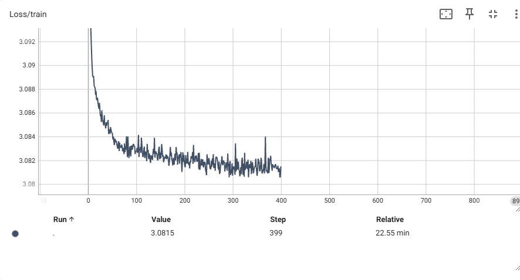
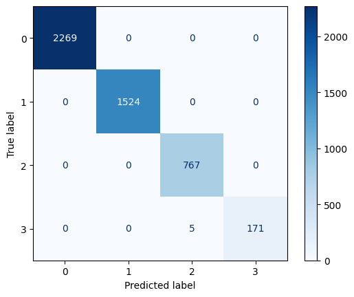
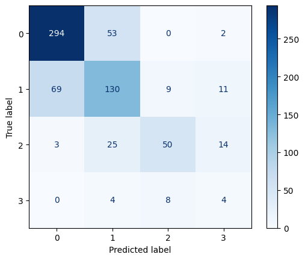

# Experiments - choice of different models

## Whole resnet18 backbone

### 1.0 ResSet18 Backbone

ResSet18 used for normal images + edges (augmented images) processed by separate CNN, outputs of each block are joined by single feed forward layer:

Logs available at `logs/1/resnet18-backbone`

Training configuration:

- 400 epochs
- L2 regularisation with lambda=0.005
- learning_rate=0.001
- code:

  ```py
  class AugmentedModel(nn.Module):
      def __init__(self, num_classes: int = 5, dropout: float = 0.5) -> None:
          super().__init__()

          weights = ResNet18_Weights.DEFAULT
          self.resnet18 = resnet18(weights=weights, progress=False)

          self.edgesClassifier = nn.Sequential(
              nn.Conv2d(1, 64, kernel_size=11, stride=4, padding=2),
              nn.ReLU(inplace=True),
              nn.MaxPool2d(kernel_size=3, stride=2),
              nn.Conv2d(64, 64, kernel_size=5, padding=2),
              nn.Dropout(p=dropout*0.4),
              nn.ReLU(inplace=True),
              nn.MaxPool2d(kernel_size=3, stride=2),
              nn.Dropout(p=dropout*0.6),
              nn.Conv2d(64, 32, kernel_size=3, padding=1),
              nn.ReLU(inplace=True),
              nn.Dropout(p=dropout*0.8),
              nn.MaxPool2d(kernel_size=3, stride=2),

              nn.Flatten(),
              nn.Dropout(p=dropout),
              nn.Linear(32 * 6 * 6, 64),
              nn.ReLU(inplace=True),
              nn.Dropout(p=dropout),
              nn.Linear(64, num_classes),
          )

          self.baseClassifier = nn.Sequential(
              nn.Linear(1000, 512),
              nn.ReLU(inplace=True),
              nn.Dropout(p=dropout * 0.5),
              nn.Linear(512, 256),
              nn.ReLU(inplace=True),
              nn.Dropout(p=dropout* 0.7),
              nn.Linear(256, 128),
              nn.ReLU(inplace=True),
              nn.Dropout(p=dropout),
              nn.Linear(128, 64),
              nn.ReLU(inplace=True),
              nn.Dropout(p=dropout),
              nn.Linear(64, num_classes),
          )

          self.outputCombiner = nn.Sequential(
              nn.Linear(2 * num_classes, num_classes),
          )

      def forward(self, image: torch.Tensor, edges: torch.Tensor) -> torch.Tensor:

          out_edges = self.edgesClassifier(edges)

          out_image = self.resnet18(image)
          out_image = self.baseClassifier(out_image)

          concated = torch.cat((out_image, out_edges), 1)

          res = self.outputCombiner(concated)
          return res


  for param in net.resnet18.parameters():
  param.requires_grad = False
  ```

Results:

- Overfitting
- Training Accuracy reached 80% while validation got stuct around 63% at 40th epoch
  
  

## 1.1 Only ResNet-18 for original images with frozen weights + FFN

Logs available at `logs/1/only-resnet18`

Here the augmented images are not used at all

### Setup:

- Model Architecture: Only ResNet-18 with frozen weights + FFN
- Optimizer: Adam
- Learning Rate: 0.001
- Batch Size: 128
- Epochs: 15
- regularization: L2, 0.001

```py
class AugmentedModel(nn.Module):
    def __init__(self, num_classes: int = 5, dropout: float = 0.5) -> None:
        super().__init__()

        weights = ResNet18_Weights.DEFAULT
        self.resnet18 = resnet18(weights=weights, progress=False)

        self.baseClassifier = nn.Sequential(
            nn.Linear(1000, 512),
            nn.ReLU(inplace=True),
            nn.Dropout(p=dropout * 0.5),
            nn.Linear(512, 256),
            nn.ReLU(inplace=True),
            nn.Dropout(p=dropout* 0.7),
            nn.Linear(256, 128),
            nn.ReLU(inplace=True),
            nn.Dropout(p=dropout),
            nn.Linear(128, 64),
            nn.ReLU(inplace=True),
            nn.Dropout(p=dropout),
            nn.Linear(64, num_classes),
        )

    def forward(self, image: torch.Tensor, edges: torch.Tensor) -> torch.Tensor:

        images = self.resnet18(image)
        images = self.baseClassifier(images)
        return images

net = AugmentedModel(3, 0.5)
net = net.to(device)

for param in net.resnet18.parameters():
    param.requires_grad = False
```

### Results:

| Metric              | Value   |
| ------------------- | ------- |
| Training Accuracy   | 66.442% |
| Validation Accuracy | 61.501% |
| Training Loss       | 10.319  |
| Validation Loss     | 0.629   |

Model starts overfitting early, for this reason, the experiment was stopped

## 2.0 Only DownScaled AlexNet

Downscaled AlexNet for original images, augmented images are not included

Logs available at `logs/2/images_downscaled_alexnet`

### Setup:

- Model Architecture: DownScaled AlexNet
- Optimizer: Adam
- Learning Rate: 0.001
- Batch Size: 128
- Epochs: 20
- regularization: None

```py
class CustomModel(nn.Module):
    def __init__(self, num_classes: int = 5, dropout: float = 0.5) -> None:
        super().__init__()

        BASE_SIZE = 8

        # Images
        self.images_features = nn.Sequential(
            nn.Conv2d(3, BASE_SIZE, kernel_size=11, stride=4, padding=2),
            nn.ReLU(inplace=True),
            nn.MaxPool2d(kernel_size=3, stride=2),
            nn.Conv2d(BASE_SIZE, BASE_SIZE*3, kernel_size=5, padding=2),
            nn.ReLU(inplace=True),
            nn.MaxPool2d(kernel_size=3, stride=2),
            nn.Conv2d(BASE_SIZE*3, BASE_SIZE*6, kernel_size=3, padding=1),
            nn.ReLU(inplace=True),
            nn.Conv2d(BASE_SIZE*6, BASE_SIZE*4, kernel_size=3, padding=1),
            nn.ReLU(inplace=True),
            nn.Conv2d(BASE_SIZE*4, BASE_SIZE*4, kernel_size=3, padding=1),
            nn.ReLU(inplace=True),
            nn.MaxPool2d(kernel_size=3, stride=2),
        )
        self.images_avgpool = nn.Sequential(
          nn.AdaptiveAvgPool2d((6, 6)),
          nn.Flatten()
        )
        self.images_classifier = nn.Sequential(
            nn.Dropout(p=dropout),
            nn.Linear(BASE_SIZE*4 * 6 * 6, BASE_SIZE*8),
            nn.ReLU(inplace=True),
            nn.Dropout(p=dropout),
            nn.Linear(BASE_SIZE*8, BASE_SIZE*4),
            nn.ReLU(inplace=True),
            nn.Linear(BASE_SIZE*4, num_classes),
        )

    def forward(self, image: torch.Tensor, edges: torch.Tensor) -> torch.Tensor:

        images = self.images_features(image)
        images = self.images_avgpool(images)
        images = self.images_classifier(images)

        return images

net = AugmentedModel(3, 0.5)
net = net.to(device)
```

### Results:

Model does not learn at all - accuracy stays at 57.442% for the whole 20 epochs which is equal to frequency of the most frequent class in the dataset

I will proceed to find the solution to this problem in the next step (3.0)

## 3.0 Overcomming excessive representation of classes in dataset

Here, I use weighted optimizer in different settings which I compare below

"Learning epoch" means number (starting from 0) of epoch at which accuracy got higher than 57.442% by at least 5% (> 62.442%)

Each method (training model) was tested for no more than 50 epochs

| Method     | Learning epoch | dropout variable | regularization param (L2) |
| ---------- | -------------- | ---------------- | ------------------------- |
| No weights | 4              | 0                | 0                         |
| Weights    | 4              | 0                | 0                         |
| No weights | 20             | 0.5              | 0                         |
| Weights    | 18             | 0.5              | 0                         |

For this experiment, nothing was logged

#### Configuration

- batch size = 128
- learning rate = 0.001

#### Used Model

Model has 202,723 parameters

```py
class CustomModel(nn.Module):
    def __init__(self, num_classes: int = 5, dropout: float = 0.5) -> None:
        super().__init__()

        self.edgesClassifier = nn.Sequential(
            nn.Conv2d(1, 64, kernel_size=11, stride=4, padding=2),
            nn.ReLU(inplace=True),
            nn.MaxPool2d(kernel_size=3, stride=2),
            nn.Conv2d(64, 64, kernel_size=5, padding=2),
            nn.Dropout(p=dropout*0.4),
            nn.ReLU(inplace=True),
            nn.MaxPool2d(kernel_size=3, stride=2),
            nn.Dropout(p=dropout*0.6),
            nn.Conv2d(64, 32, kernel_size=3, padding=1),
            nn.ReLU(inplace=True),
            nn.Dropout(p=dropout*0.8),
            nn.MaxPool2d(kernel_size=3, stride=2),

            nn.Flatten(),
            nn.Dropout(p=dropout),
            nn.Linear(32 * 6 * 6, 64),
            nn.ReLU(inplace=True),
            nn.Dropout(p=dropout),
            nn.Linear(64, num_classes),
        )

    def forward(self, image: torch.Tensor, edges: torch.Tensor) -> torch.Tensor:

        # Edges
        edges = self.edgesClassifier(edges)

        return edges
```

### Optimizer configurations used

#### No weights

```py
criterion = nn.CrossEntropyLoss()
optimizer = optim.Adam(model.parameters(), lr=0.001)
```

#### Weights

```py
class_weights = get_classes_frequencies(train_dataset)
weights_tensor = torch.Tensor(list(class_weights.values())).to(device)

criterion = nn.CrossEntropyLoss(weights_tensor)
optimizer = optim.Adam(model.parameters(), lr=0.001)
```

### Results

Seems like the existence of weights in criterion was not at fault.

I assume the issue with the initial model was solved by training solely on augmented images, instead of original ones.


## 4.0 Testing Double Input Architecture of the Model

In this experiment I process both inputs separately and then connect them via FFN

- "Reached 90% Training" - Epoch number (counting from 1) at which model reached or exceeded 90% of training accuracy
- Validation Accuracy at the epoch from "Reached 90% Training" column
- Models were tested up to 50th epoch

| Method                   | Reached 90% Training | Validation Accuracy | dropout variable | regularization param (L2) | Comments                                                                                                     |
| ------------------------ | -------------------- | ------------------- | ---------------- | ------------------------- | ------------------------------------------------------------------------------------------------------------ |
| Joined Classes           | 19                   | 68.644%             | 0                | 0                         |                                                                                                              |
| Joined Classes           |                      |                     | 0.5              | 0.001                     | At 50th epoch, train_acc=82.226%, val_acc=61.501%                                                            |
| Intermediary Space       | 26                   | 67.676%             | 0                | 0                         |                                                                                                              |
| Intermediary Space       |                      |                     | 0.5              | 0.001                     | At 50th epoch, train_acc=80.910%, val_acc=66.586%                                                            |
| Early Intermediary Space | 26                   | 66.223%             | 0                | 0                         |                                                                                                              |
| Early Intermediary Space |                      |                     | 0.5              | 0.001                     | At 50th epoch, train_acc=78.401%, 90% reached at 80th epoch, at 100th, validation accuracy was still 66.344% |

Logs are available at `logs/experiments/4/<row_nr>` - each row in the table above has its own subfolder

#### Configuration

- batch size = 128
- learning rate = 0.001

### Used Models

#### "Joined Classes"

I join classes at the end with single perceptron

Model has 486491 parameters

```py
class CustomModel(nn.Module):
    def __init__(self, num_classes: int = 5, dropout: float = 0.5) -> None:
        super().__init__()
        
        # Size of layer block
        S = 32
        
        # Images
        self.imagesClassifier = nn.Sequential(
            nn.Conv2d(3, S*2, kernel_size=11, stride=4, padding=2),
            nn.ReLU(inplace=True),
            nn.MaxPool2d(kernel_size=3, stride=2),
            nn.Conv2d(S*2, S*2, kernel_size=5, padding=2),
            nn.ReLU(inplace=True),
            nn.MaxPool2d(kernel_size=3, stride=2),
            nn.Conv2d(S*2, S*2, kernel_size=3, padding=1),
            nn.ReLU(inplace=True),
            nn.Conv2d(S*2, S, kernel_size=3, padding=1),
            nn.ReLU(inplace=True),
            nn.MaxPool2d(kernel_size=3, stride=2),
            
            nn.Flatten(),
            nn.Dropout(p=dropout),
            nn.Linear(S * 7 * 7, S*2),
            nn.ReLU(inplace=True),
            nn.Dropout(p=dropout),
            nn.Linear(S*2, S),
            nn.ReLU(inplace=True),
            nn.Linear(S, num_classes),
        )

        self.edgesClassifier = nn.Sequential(
            nn.Conv2d(1, S*2, kernel_size=11, stride=4, padding=2),
            nn.ReLU(inplace=True),
            nn.MaxPool2d(kernel_size=3, stride=2),
            nn.Conv2d(S*2, S*2, kernel_size=5, padding=2),
            nn.Dropout(p=dropout*0.4),
            nn.ReLU(inplace=True),
            nn.MaxPool2d(kernel_size=3, stride=2),
            nn.Dropout(p=dropout*0.6),
            nn.Conv2d(S*2, S, kernel_size=3, padding=1),
            nn.ReLU(inplace=True),
            nn.Dropout(p=dropout*0.8),
            nn.MaxPool2d(kernel_size=3, stride=2),
            
            nn.Flatten(),
            nn.Dropout(p=dropout),
            nn.Linear(S * 6 * 6, S*2),
            nn.ReLU(inplace=True),
            nn.Dropout(p=dropout),
            nn.Linear(S*2, num_classes),
        )
        
        self.outputCombiner = nn.Sequential(
            nn.Linear(2 * num_classes, num_classes),
        )

    def forward(self, images: torch.Tensor, edges: torch.Tensor) -> torch.Tensor:
        
        # Images
        images = self.imagesClassifier(images)
        
        # Edges
        edges = self.edgesClassifier(edges)
        
        
        # Combining outputs
        concated = torch.cat((images, edges), 1)
        res = self.outputCombiner(concated)
        
        return res
```

#### "Intermediary Space"

I join flattened outcomes of each CNN and after one Linear Layer, I pass them through longer Linear Neural Network

Model has 499683 parameters

```py
class IntermediarySpaceModel(nn.Module):
    def __init__(self, num_classes: int = 5, dropout: float = 0.5) -> None:
        super().__init__()
        
        # Size of layer block
        S = 32
        
        # Images
        self.imagesClassifier = nn.Sequential(
            nn.Conv2d(3, S*2, kernel_size=11, stride=4, padding=2),
            nn.ReLU(inplace=True),
            nn.MaxPool2d(kernel_size=3, stride=2),
            nn.Conv2d(S*2, S*2, kernel_size=5, padding=2),
            nn.ReLU(inplace=True),
            nn.MaxPool2d(kernel_size=3, stride=2),
            nn.Conv2d(S*2, S*2, kernel_size=3, padding=1),
            nn.ReLU(inplace=True),
            nn.Conv2d(S*2, S, kernel_size=3, padding=1),
            nn.ReLU(inplace=True),
            nn.MaxPool2d(kernel_size=3, stride=2),
            
            nn.Flatten(),
            nn.Dropout(p=dropout),
            nn.Linear(S * 7 * 7, S*2),
        )

        self.edgesClassifier = nn.Sequential(
            nn.Conv2d(1, S*2, kernel_size=11, stride=4, padding=2),
            nn.ReLU(inplace=True),
            nn.MaxPool2d(kernel_size=3, stride=2),
            nn.Conv2d(S*2, S*2, kernel_size=5, padding=2),
            nn.Dropout(p=dropout*0.4),
            nn.ReLU(inplace=True),
            nn.MaxPool2d(kernel_size=3, stride=2),
            nn.Dropout(p=dropout*0.6),
            nn.Conv2d(S*2, S, kernel_size=3, padding=1),
            nn.ReLU(inplace=True),
            nn.Dropout(p=dropout*0.8),
            nn.MaxPool2d(kernel_size=3, stride=2),
            
            nn.Flatten(),
            nn.Dropout(p=dropout),
            nn.Linear(S * 6 * 6, S*2),
        )
        
        self.outputCombiner = nn.Sequential(
            nn.ReLU(inplace=True),
            nn.Dropout(p=dropout),
            nn.Linear(S*4, S*3),
            nn.ReLU(inplace=True),
            nn.Dropout(p=dropout),
            nn.Linear(S*3, S),
            nn.Dropout(p=dropout),
            nn.ReLU(inplace=True),
            nn.Linear(S, num_classes),
        )

    def forward(self, images: torch.Tensor, edges: torch.Tensor) -> torch.Tensor:
        
        # Images
        images = self.imagesClassifier(images)
        
        # Edges
        edges = self.edgesClassifier(edges)
        
        # Combining outputs
        concated = torch.cat((images, edges), 1)
        res = self.outputCombiner(concated)
        
        return res
```

#### "Early Intermediary Space"

I join flattened outcomes of each CNN and immediatelly pass them through longer Linear Neural Network

Model has 499683 parameters

```py
class EarlyIntermediarySpaceModel(nn.Module):
    def __init__(self, num_classes: int = 5, dropout: float = 0.5) -> None:
        super().__init__()
        
        # Size of layer block
        S = 32
        
        # Images
        self.imagesClassifier = nn.Sequential(
            nn.Conv2d(3, S*2, kernel_size=11, stride=4, padding=2),
            nn.ReLU(inplace=True),
            nn.MaxPool2d(kernel_size=3, stride=2),
            nn.Conv2d(S*2, S*2, kernel_size=5, padding=2),
            nn.ReLU(inplace=True),
            nn.MaxPool2d(kernel_size=3, stride=2),
            nn.Conv2d(S*2, S*2, kernel_size=3, padding=1),
            nn.ReLU(inplace=True),
            nn.Conv2d(S*2, S, kernel_size=3, padding=1),
            nn.ReLU(inplace=True),
            nn.MaxPool2d(kernel_size=3, stride=2),
            
            nn.Flatten(),
        )

        self.edgesClassifier = nn.Sequential(
            nn.Conv2d(1, S*2, kernel_size=11, stride=4, padding=2),
            nn.ReLU(inplace=True),
            nn.MaxPool2d(kernel_size=3, stride=2),
            nn.Conv2d(S*2, S*2, kernel_size=5, padding=2),
            nn.Dropout(p=dropout*0.4),
            nn.ReLU(inplace=True),
            nn.MaxPool2d(kernel_size=3, stride=2),
            nn.Dropout(p=dropout*0.6),
            nn.Conv2d(S*2, S, kernel_size=3, padding=1),
            nn.ReLU(inplace=True),
            nn.Dropout(p=dropout*0.8),
            nn.MaxPool2d(kernel_size=3, stride=2),
            
            nn.Flatten(),
        )
        
        IMAGES_OUTPUT_LEN = S * 7 * 7
        EDGES_OUTPUT_LEN = S * 6 * 6
        
        CNNs_OUTPUT_SIZE = IMAGES_OUTPUT_LEN + EDGES_OUTPUT_LEN
        
        self.outputCombiner = nn.Sequential(
            nn.ReLU(inplace=True),
            nn.Dropout(p=dropout),
            nn.Linear(CNNs_OUTPUT_SIZE, S*3),
            nn.ReLU(inplace=True),
            nn.Dropout(p=dropout),
            nn.Linear(S*3, S),
            nn.ReLU(inplace=True),
            nn.Dropout(p=dropout),
            nn.Linear(S, num_classes),
        )

    def forward(self, images: torch.Tensor, edges: torch.Tensor) -> torch.Tensor:
        
        # Images
        images = self.imagesClassifier(images)
        
        # Edges
        edges = self.edgesClassifier(edges)
        
        # Combining outputs
        concated = torch.cat((images, edges), 1)
        res = self.outputCombiner(concated)
        
        return res
```

# General Observation
All the tested models were overfitting - while the training accuracy were reaching 80-95%, the validation accuracy had been reaching top 67%.
I assume, the reason may be the inequality of data between validation and training dataset

Turns out the data was dividen in not so wise way.

## Attempts to solve problems
- I organized dataset in what I believe is a better way - I left all the classes except for 2nd (doubtful), instead of merging some of them into one.

- I tried to reshuffle the whole dataset (assuming unequal representation of features) joining all 3 datasets and then splitting them again in random order. This didn't visibly solve the problem and even if, by no more than 2-3 perc. points of validation accuracy.

- For better interpretability, I added confusion matrix and classification report table from sklearn (precision, recall, f1-score)

- I got back to the previously used `IntermediarySpaceModel` which I will further adjust performing hyperparameter tuning with the use of optuna framework

- I started using decaying learning rate

### Experiment 5.0

Logs available at `logs/5/0`

I ran model for 210 epochs to see how the classification matrices would look like

Parameters:
- initial lr = 0.001
- lr decay -> 0.6 each 100 epochs
- regularization -> "L2", lambda=0.003
- dropout param -> 0.5

model architecture:

```py
class IntermediarySpaceModel(nn.Module):
    def __init__(self, num_classes: int = 5, dropout: float = 0.5) -> None:
        super().__init__()
        
        # Size of layer block
        S = 24
        
        # Images
        self.imagesClassifier = nn.Sequential(
            nn.Conv2d(3, S*2, kernel_size=11, stride=4, padding=2),
            nn.ReLU(inplace=True),
            nn.MaxPool2d(kernel_size=3, stride=2),
            nn.Dropout(p=dropout*0.2),
            nn.Conv2d(S*2, S*2, kernel_size=5, padding=2),
            nn.ReLU(inplace=True),
            nn.MaxPool2d(kernel_size=3, stride=2),
            nn.Dropout(p=dropout*0.4),
            nn.Conv2d(S*2, S*2, kernel_size=3, padding=1),
            nn.ReLU(inplace=True),
            nn.Dropout(p=dropout*0.6),
            nn.Conv2d(S*2, S, kernel_size=3, padding=1),
            nn.ReLU(inplace=True),
            nn.MaxPool2d(kernel_size=3, stride=2),
            
            nn.Flatten(),
            nn.Dropout(p=dropout*0.8),
            nn.Linear(S * 7 * 7, S*2),
        )

        self.edgesClassifier = nn.Sequential(
            nn.Conv2d(1, S*2, kernel_size=11, stride=4, padding=2),
            nn.ReLU(inplace=True),
            nn.MaxPool2d(kernel_size=3, stride=2),
            nn.Dropout(p=dropout*0.4),
            nn.Conv2d(S*2, S*2, kernel_size=5, padding=2),
            nn.ReLU(inplace=True),
            nn.MaxPool2d(kernel_size=3, stride=2),
            nn.Dropout(p=dropout*0.6),
            nn.Conv2d(S*2, S, kernel_size=3, padding=1),
            nn.ReLU(inplace=True),
            nn.MaxPool2d(kernel_size=3, stride=2),
            
            nn.Flatten(),
            nn.Dropout(p=dropout*0.8),
            nn.Linear(S * 6 * 6, S*2),
        )
        
        self.outputCombiner = nn.Sequential(
            nn.ReLU(inplace=True),
            nn.Dropout(p=dropout),
            nn.Linear(S*4, S*3),
            nn.ReLU(inplace=True),
            nn.Dropout(p=dropout),
            nn.Linear(S*3, S),
            nn.ReLU(inplace=True),
            nn.Dropout(p=dropout),
            nn.Linear(S, num_classes),
        )

    def forward(self, images: torch.Tensor, edges: torch.Tensor) -> torch.Tensor:
        
        # Images
        images = self.imagesClassifier(images)
        
        # Edges
        edges = self.edgesClassifier(edges)
        
        # Combining outputs
        concated = torch.cat((images, edges), 1)
        res = self.outputCombiner(concated)
        
        return res
```

Output at 210 epoch:
> Epoch 209: Training: accuracy: 99.873%, loss: 0.069; Validation: accuracy: 70.710%, loss: 1.563


**Training confusion matrix:**



**Validation confusion matrix:**



**Test confusion matrix:**


### Test of the confusion matrix logging

logs at [tensorboard_logs](logs/experiments/5/confusion_matrix_test)

It seems that model first classifies all the examples to one class (typically 0 - healthy), and then as the training goes, adds another, more or less in order of their frequency of occurences in the dataset - Class 4 - severe is classified at the end as it is the rarer.

## Conclusion and Next Steps

All the models achieve validation accuracy of aproximately 70% while the models are capable of reching training accuracy of 98-100%.

It is difficult to choose one model as they all perform similarly and the performance on validation set and efficiency of training can be expected to be highly dependant on the hyperparameters used (ex. dropout, regularization, etc.).

Because of that I chose to proceed with `IntermediarySpaceModel` which I will try to further improve using automated hyperparameter tunning using `Optuna` frameworks.

The hyperparameters tunning:
- [hyperparam_tunning.ipynb](hyperparam_tunning.ipynb)
- [hyperparameters_results.md](hyperparameters_results.md)