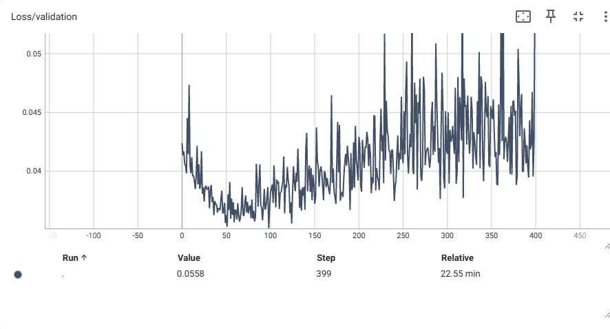

# Experiments
## Whole resnet18 backbone
### Experiment 1 (resnet18 + edges):
  Configuration:
  - 400 epochs
  - L2 regularisation with lambda=0.005
  - learning_rate=0.001
  - code:
    ```py
    class AugmentedModel(nn.Module):
        def __init__(self, num_classes: int = 5, dropout: float = 0.5) -> None:
            super().__init__()
            
            weights = ResNet18_Weights.DEFAULT
            self.resnet18 = resnet18(weights=weights, progress=False)
            
            self.edgesClassifier = nn.Sequential(
                nn.Conv2d(1, 64, kernel_size=11, stride=4, padding=2),
                nn.ReLU(inplace=True),
                nn.MaxPool2d(kernel_size=3, stride=2),
                nn.Conv2d(64, 64, kernel_size=5, padding=2),
                nn.Dropout(p=dropout*0.4),
                nn.ReLU(inplace=True),
                nn.MaxPool2d(kernel_size=3, stride=2),
                nn.Dropout(p=dropout*0.6),
                nn.Conv2d(64, 32, kernel_size=3, padding=1),
                nn.ReLU(inplace=True),
                nn.Dropout(p=dropout*0.8),
                nn.MaxPool2d(kernel_size=3, stride=2),
                
                nn.Flatten(),
                nn.Dropout(p=dropout),
                nn.Linear(32 * 6 * 6, 64),
                nn.ReLU(inplace=True),
                nn.Dropout(p=dropout),
                nn.Linear(64, num_classes),
            )
            
            self.baseClassifier = nn.Sequential(
                nn.Linear(1000, 512),
                nn.ReLU(inplace=True),
                nn.Dropout(p=dropout * 0.5),
                nn.Linear(512, 256),
                nn.ReLU(inplace=True),
                nn.Dropout(p=dropout* 0.7),
                nn.Linear(256, 128),
                nn.ReLU(inplace=True),
                nn.Dropout(p=dropout),
                nn.Linear(128, 64),
                nn.ReLU(inplace=True),
                nn.Dropout(p=dropout),
                nn.Linear(64, num_classes),
            )
            
            self.outputCombiner = nn.Sequential(
                nn.Linear(2 * num_classes, num_classes),
            )

        def forward(self, image: torch.Tensor, edges: torch.Tensor) -> torch.Tensor:

            out_edges = self.edgesClassifier(edges)
          
            out_image = self.resnet18(image)
            out_image = self.baseClassifier(out_image)
            
            concated = torch.cat((out_image, out_edges), 1)
            
            res = self.outputCombiner(concated)
            return res


    for param in net.resnet18.parameters():
    param.requires_grad = False
    ```
    
  Results
  - Overfitting
  - Training Accuracy reached 80% while validation got stuct around 63% at 40th epoch
    
    

### Only ResNet-18 with frozen weights + FFN

### Setup:
- Model Architecture: Only ResNet-18 with frozen weights + FFN
- Optimizer: Adam
- Learning Rate: 0.001
- Batch Size: 128
- Epochs: 15
- regularization: L2, 0.001

```py
class AugmentedModel(nn.Module):
    def __init__(self, num_classes: int = 5, dropout: float = 0.5) -> None:
        super().__init__()
        
        weights = ResNet18_Weights.DEFAULT
        self.resnet18 = resnet18(weights=weights, progress=False)
        
        self.baseClassifier = nn.Sequential(
            nn.Linear(1000, 512),
            nn.ReLU(inplace=True),
            nn.Dropout(p=dropout * 0.5),
            nn.Linear(512, 256),
            nn.ReLU(inplace=True),
            nn.Dropout(p=dropout* 0.7),
            nn.Linear(256, 128),
            nn.ReLU(inplace=True),
            nn.Dropout(p=dropout),
            nn.Linear(128, 64),
            nn.ReLU(inplace=True),
            nn.Dropout(p=dropout),
            nn.Linear(64, num_classes),
        )

    def forward(self, image: torch.Tensor, edges: torch.Tensor) -> torch.Tensor:
        
        images = self.resnet18(image)
        images = self.baseClassifier(images)
        return images

net = AugmentedModel(3, 0.5)
net = net.to(device)

for param in net.resnet18.parameters():
    param.requires_grad = False
```

### Results:
| Metric          | Value           |
|------------------|-----------------|
| Training Accuracy| 66.442%          |
| Validation Accuracy | 61.501%      |
| Training Loss    | 10.319           |
| Validation Loss  | 0.629           |

### Observations:
- Overfitting observed at 15 epoch. Early stopping was applied.
- Lower validation accuracy compared to training accuracy; potential model generalization issues. (Makes sense as ResNet18 was trained on CIFAR-1000)

### Visualizations:
- [Confusion Matrix](path/to/image)
- [Learning Curves](path/to/image)

### Only DownScaled AlexNet

### Setup:
- Model Architecture: DownScaled AlexNet
- Optimizer: Adam
- Learning Rate: 0.001
- Batch Size: 128
- Epochs: 20
- regularization: None

```py
class CustomModel(nn.Module):
    def __init__(self, num_classes: int = 5, dropout: float = 0.5) -> None:
        super().__init__()
        
        BASE_SIZE = 8
        
        # Images
        self.images_features = nn.Sequential(
            nn.Conv2d(3, BASE_SIZE, kernel_size=11, stride=4, padding=2),
            nn.ReLU(inplace=True),
            nn.MaxPool2d(kernel_size=3, stride=2),
            nn.Conv2d(BASE_SIZE, BASE_SIZE*3, kernel_size=5, padding=2),
            nn.ReLU(inplace=True),
            nn.MaxPool2d(kernel_size=3, stride=2),
            nn.Conv2d(BASE_SIZE*3, BASE_SIZE*6, kernel_size=3, padding=1),
            nn.ReLU(inplace=True),
            nn.Conv2d(BASE_SIZE*6, BASE_SIZE*4, kernel_size=3, padding=1),
            nn.ReLU(inplace=True),
            nn.Conv2d(BASE_SIZE*4, BASE_SIZE*4, kernel_size=3, padding=1),
            nn.ReLU(inplace=True),
            nn.MaxPool2d(kernel_size=3, stride=2),
        )
        self.images_avgpool = nn.Sequential(
          nn.AdaptiveAvgPool2d((6, 6)),
          nn.Flatten()
        )
        self.images_classifier = nn.Sequential(
            nn.Dropout(p=dropout),
            nn.Linear(BASE_SIZE*4 * 6 * 6, BASE_SIZE*8),
            nn.ReLU(inplace=True),
            nn.Dropout(p=dropout),
            nn.Linear(BASE_SIZE*8, BASE_SIZE*4),
            nn.ReLU(inplace=True),
            nn.Linear(BASE_SIZE*4, num_classes),
        )

    def forward(self, image: torch.Tensor, edges: torch.Tensor) -> torch.Tensor:
        
        images = self.images_features(image)
        images = self.images_avgpool(images)
        images = self.images_classifier(images)
        
        return images

net = AugmentedModel(3, 0.5)
net = net.to(device)
```

### Results:
Model does not learn at all - accuracy stays at 57.442% for the whole 20 epochs which is equal to frequency of the most frequent class in the dataset

I will proceed to find the solution to this problem