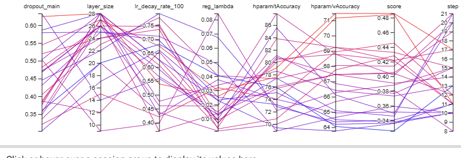
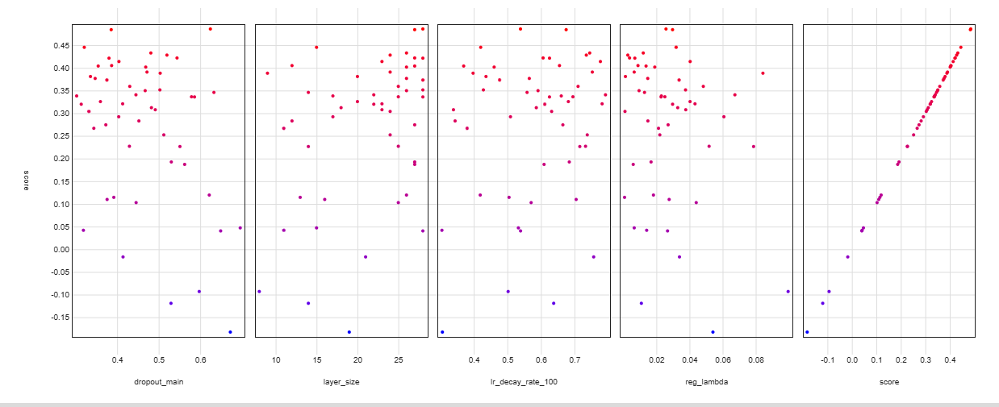

## Experiment Setup

I ran 50 trials of optuna study with following setup:

### The model created - `IntermediarySpaceModel` from previous [experiments](experiments.md)
```py
def define_model(trial, layer_size, dropout_main):
    class IntermediarySpaceModel(nn.Module):
        def __init__(self, train_device, num_classes: int = 5, dropout: float = 0.5) -> None:
            super().__init__()
            
            # Size of layer block
            
            S = layer_size
            # S = trial.suggest_int(layer_size, 12, 24)
            self.train_device = train_device
            
            # Images
            self.imagesClassifier = nn.Sequential(
                nn.Conv2d(3, S*2, kernel_size=11, stride=4, padding=2),
                nn.ReLU(inplace=True),
                nn.MaxPool2d(kernel_size=3, stride=2),
                nn.Dropout(p=dropout*0.2),
                nn.Conv2d(S*2, S*2, kernel_size=5, padding=2),
                nn.ReLU(inplace=True),
                nn.MaxPool2d(kernel_size=3, stride=2),
                nn.Dropout(p=dropout*0.4),
                nn.Conv2d(S*2, S*2, kernel_size=3, padding=1),
                nn.ReLU(inplace=True),
                nn.Dropout(p=dropout*0.6),
                nn.Conv2d(S*2, S, kernel_size=3, padding=1),
                nn.ReLU(inplace=True),
                nn.MaxPool2d(kernel_size=3, stride=2),
                
                nn.Flatten(),
                nn.Dropout(p=dropout*0.8),
                nn.Linear(S * 7 * 7, S*2),
            )

            self.edgesClassifier = nn.Sequential(
                nn.Conv2d(1, S*2, kernel_size=11, stride=4, padding=2),
                nn.ReLU(inplace=True),
                nn.MaxPool2d(kernel_size=3, stride=2),
                nn.Dropout(p=dropout*0.4),
                nn.Conv2d(S*2, S*2, kernel_size=5, padding=2),
                nn.ReLU(inplace=True),
                nn.MaxPool2d(kernel_size=3, stride=2),
                nn.Dropout(p=dropout*0.6),
                nn.Conv2d(S*2, S, kernel_size=3, padding=1),
                nn.ReLU(inplace=True),
                nn.MaxPool2d(kernel_size=3, stride=2),
                
                nn.Flatten(),
                nn.Dropout(p=dropout*0.8),
                nn.Linear(S * 6 * 6, S*2),
            )
            
            self.outputCombiner = nn.Sequential(
                nn.ReLU(inplace=True),
                nn.Dropout(p=dropout),
                nn.Linear(S*4, S*3),
                nn.ReLU(inplace=True),
                nn.Dropout(p=dropout),
                nn.Linear(S*3, S),
                nn.ReLU(inplace=True),
                nn.Dropout(p=dropout),
                nn.Linear(S, num_classes),
            )
            
        def forward(self, data: tuple) -> torch.Tensor:
            
            images, edges = data
            
            images = images.to(self.train_device)
            edges = edges.to(self.train_device)
            
            # Images
            images = self.imagesClassifier(images)
            
            # Edges
            edges = self.edgesClassifier(edges)
            
            # Combining outputs
            concated = torch.cat((images, edges), 1)
            res = self.outputCombiner(concated)
            
            return res

    # DROPOUT_MAIN = trial.suggest_float(dropout_main, 0.3, 0.7)
    model = IntermediarySpaceModel(device, 4, dropout_main)
    model = model.to(device)
    
    return model

```

#### Adjusted hyperparameters [with ranges]:
- layer size (`layer_size` argument of `IntermediarySpaceModel`) - [8, 28]
- main dropout (`dropout_main` argument of `IntermediarySpaceModel`) - [0.3, 0.7]
- learning rate decay per 100 epochs - [0.3, 0.8]
- lambda parameter of regularization - [0.0001, 0.1]

#### Constant variables:
- optimizer - Adam with default pytorch setting
- Learning rate - 0.001
- regularization type - L2
- sampler - `TPESampler()` from optuna framework

### Evaluation rule - score formula

For each trial, the training is ran for tops 50 epoch. Additionally, it stops when during 3 consecutive steps, the difference between accuracies (training - validation) is growing. 

Because of this method, it is possible to measure the validation accuracies at the moment when overfitting start to occur.

The score which the optuna uses to evaluate is described by formula:

*score = ((vAcc - 0.5) / tAcc) + (vAcc - 0.5)*

where:
- vAcc, tAcc are respectively, validation and training accuracies after 3rd step of overfitting in range of [0, 1]

## Results
The results are saved as tensorboard logs in "logs/hyperparameter_tunning_ratio_abs" directory

To run tenosrboard the following command has to be executed: `tensorboard --logdir logs/hyperparameter_tunning_ratio_abs`

## Conclusions



(This is a plot of 25 (half) of the traials with highest score)

As we can see, the top scores align with the trials that acquired highest validation accuracy while maintaining relatively low training accuracy

### Scatterplot



(all trials)

From the scatterplot, it can be seen, that best scores correspond with:
- relatively low dropout rate
- high sizes of layers
- no particular learning rate decay (probably because of short lasting experiments)
- low regularization lambda parameter

## Further training

I picked hyperparameters based on 2 top trials which will be further used to train model for more epochs:
- layer size - 27 and 28 -> 28
- main dropout - 0.62445 and 0.38567 -> 0.5
- learning rate decay per 100 epochs - 0.53909 and 0.67510 -> 0.5 (because training will take longer than during experiments)
- regularization lambda - 0.025823 and 0.029792 -> 0.027

## Training model with picked hyperparameters

Model was trained for 500 epochs with initial **learning rate of 0.0001** and **batch size of 512** and learning rate decay of 0.5 per 100 epochs.

## Results

On test set, the model reaches accuracy of 70.214% and 93.476% on the training dataset.

The training logs are available in `logs/hyperparameters_tunned/final` directory.

Result model is located at `saved_models/model_saved.pt`.

