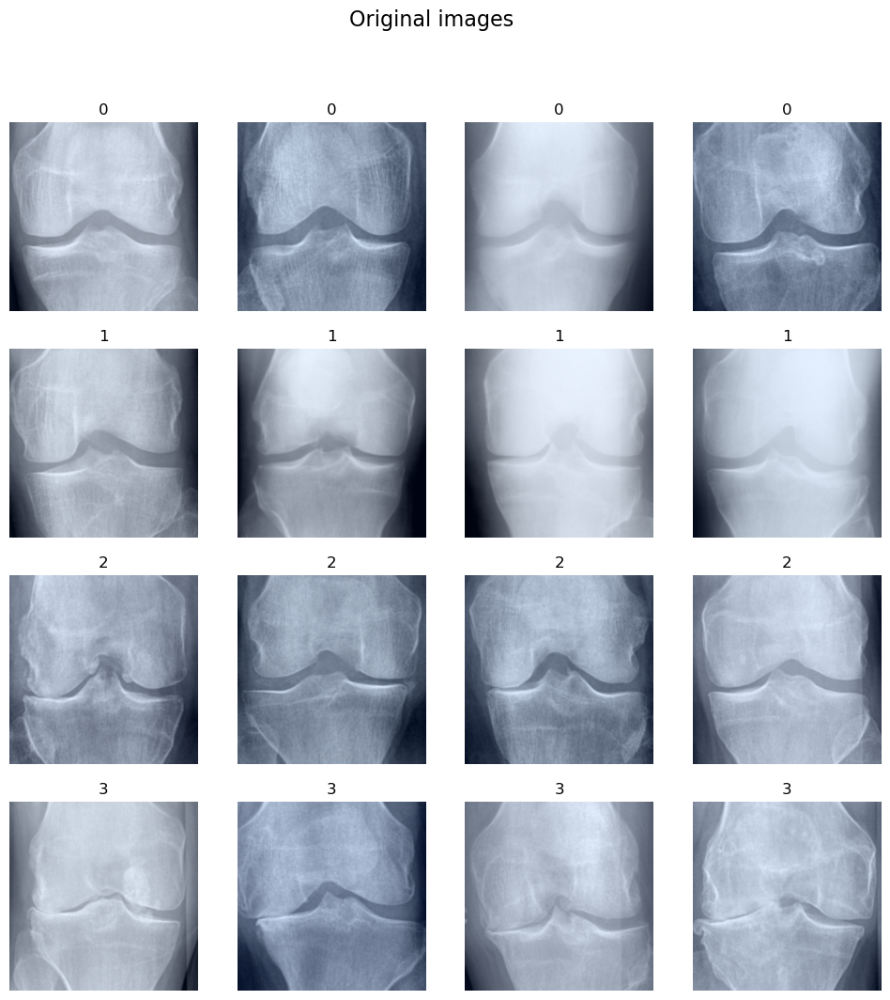
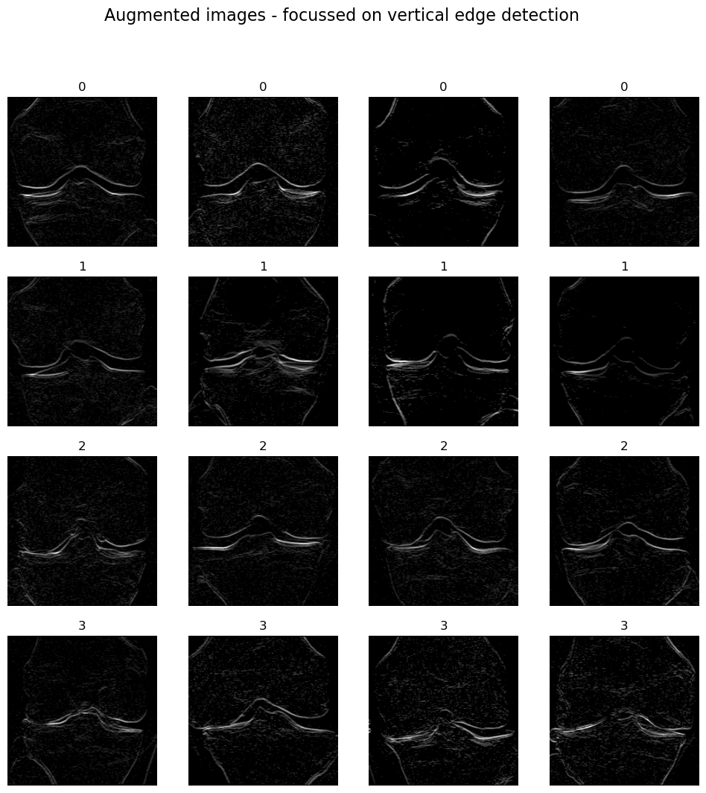

# Knee Osteoarthritis Classification Project

This project focuses on classifying knee osteoarthritis severity using deep learning techniques. The dataset was reorganized to exclude class 2 (doubtful cases), and data augmentation was applied by generating grayscale images with highlighted edges. Various models were tested, incorporating strategies such as weighted loss to address class imbalance and a decaying learning rate. A trainer class was developed to streamline the training process, and TensorBoard was utilized for experiment logging. Hyperparameter tuning was conducted using Optuna to optimize model performance.

## Table of Contents

- [Project Overview](#project-overview)
- [Dataset](#dataset)
  - [Data Reorganization](#data-reorganization)
  - [Data Augmentation](#data-augmentation)
- [Techniques Used](#techniques-used)
  - [Weighted Loss](#weighted-loss)
  - [Decaying Learning Rate](#decaying-learning-rate)
  - [Trainer Class](#trainer-class)
  - [TensorBoard Logging](#tensorboard-logging)
- [Experiments](#experiments)
- [Hyperparameter Tuning](#hyperparameter-tuning)
- [Results](#results)
- [Conclusion](#conclusion)
- [References](#references)

## Project Overview

The objective of this project is to develop a robust model for classifying knee osteoarthritis severity from X-ray images. By reorganizing and augmenting the dataset, implementing advanced training techniques, and performing hyperparameter optimization, the project aims to achieve high classification accuracy.

## Dataset

Dataset was downloaded from [kaggle](https://www.kaggle.com/datasets/shashwatwork/knee-osteoarthritis-dataset-with-severity)

### Content
> This dataset contains knee X-ray data for both knee joint detection and knee KL grading. The Grade descriptions are as follows:
>- Grade 0: Healthy knee image.
>- Grade 1 (Doubtful): Doubtful joint narrowing with possible osteophytic lipping
>- Grade 2 (Minimal): Definite presence of osteophytes and possible joint space narrowing
>- Grade 3 (Moderate): Multiple osteophytes, definite joint space narrowing, with mild sclerosis.
>- Grade 4 (Severe): Large osteophytes, significant joint narrowing, and severe sclerosis.

### Data Reorganization

The original dataset included images labeled from class 0 to class 4, corresponding to different severity levels of osteoarthritis. Class 1 (doubtful cases) was removed to focus on clearer distinctions between severity levels. Rest of classes got their labels decreased to fill the empty space (2 -> 1, 3 -> 2 ...)

### Data Augmentation

To enhance the dataset, additional inputs were created by converting images to grayscale and applying edge detection filters. This augmentation aims to highlight structural features relevant to osteoarthritis classification.

*Visualization of Original and Augmented Images:*

*Original X-ray image.*

*Augmented grayscale image with highlighted edges.*

## Experiments

Experiments were conducted to choose the best model architecture and solve problems coming from class imbalance

Detailed descriptions of the experiments, including model architectures and training configurations, are documented in [experiments.md](experiments.md).

## Techniques Used During Training

### Weighted Loss

Due to class imbalance in the dataset, a weighted loss function was employed to assign higher penalties to misclassifications in underrepresented classes, thereby improving model performance across all classes.

### Decaying Learning Rate

A learning rate schedule was implemented to reduce the learning rate as training progresses, allowing the model to converge more effectively by making smaller adjustments during later training stages.

### Trainer Class

A custom trainer class was developed to encapsulate the training loop, enabling easier experimentation with different models and hyperparameters.

### TensorBoard

TensorBoard was used to log metrics such as loss and accuracy during training, providing visual insights into the model's performance over time.

## Hyperparameter Tuning

Hyperparameter optimization was performed using Optuna, an open-source hyperparameter optimization framework designed for machine learning. Optuna's define-by-run API allows for dynamic construction of search spaces, facilitating efficient exploration of hyperparameters. :contentReference[oaicite:0]{index=0}

The results of the hyperparameter tuning experiments, including the optimal hyperparameters identified, are documented in [hyperparameters_results.md](hyperparameters_results.md).

- [Hyperparameter Tunning notebook](hyperparam_tunning.ipynb)
- [Final Model Training ](main.ipynb)

## Results

The combination of data augmentation, weighted loss, decaying learning rate, and hyperparameter tuning led to slightly improved classification accuracy on test set. 

Specific performance metrics and comparisons are detailed in the [hyperparameters_results.md](hyperparameters_results.md).
Final model can be found at [saved_models/model_saved.pt](saved_models/model_saved.pt)

## References

- [Optuna: A hyperparameter optimization framework](https://optuna.org/)
- [Knee Osteoarthritis Dataset with Severity Grading](https://www.kaggle.com/datasets/shashwatwork/knee-osteoarthritis-dataset-with-severity)
